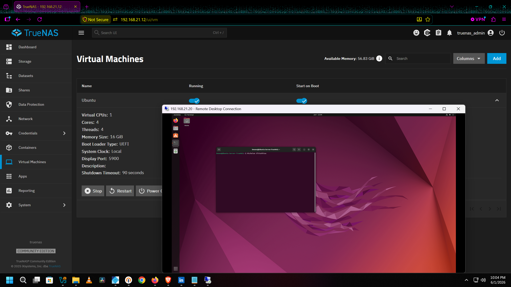
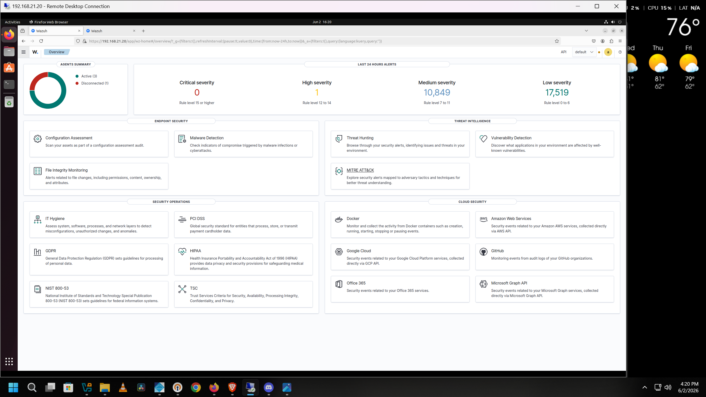
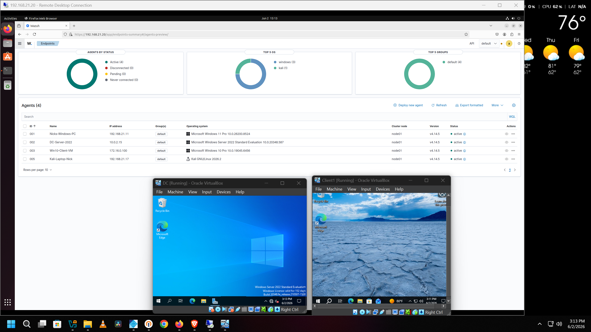
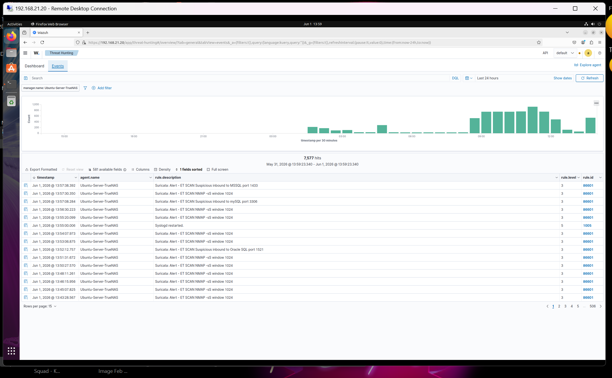
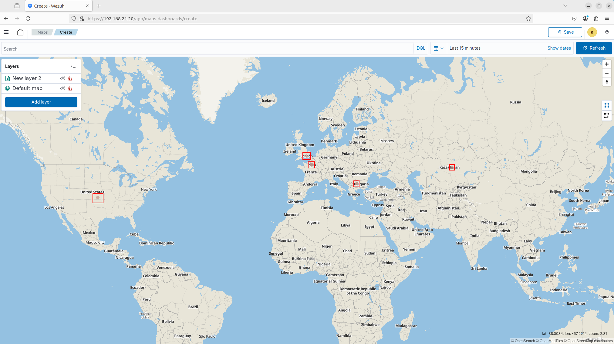
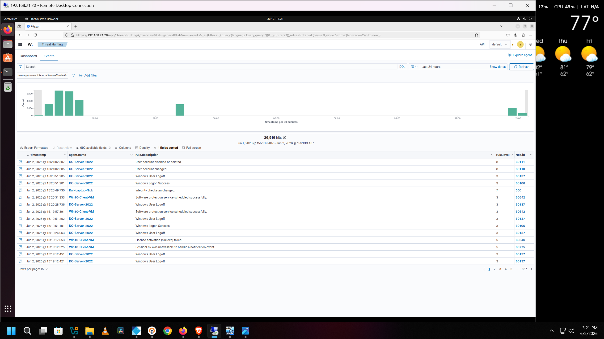
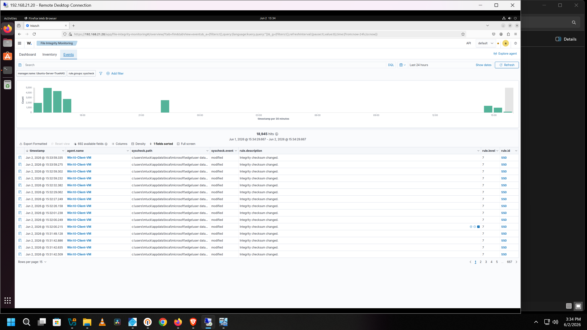
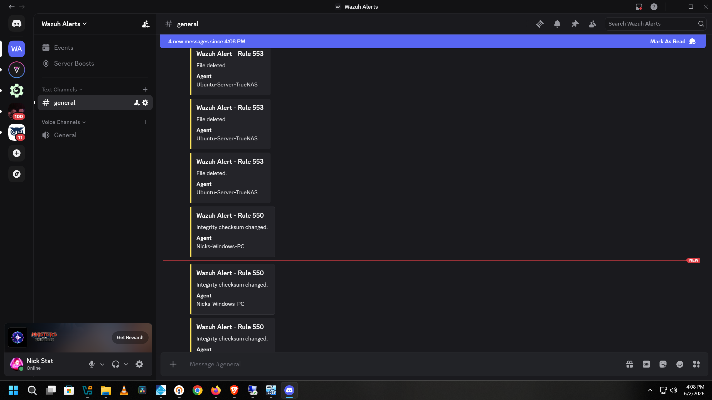
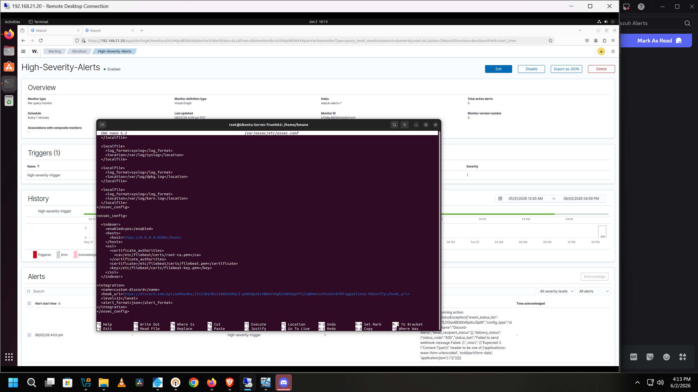
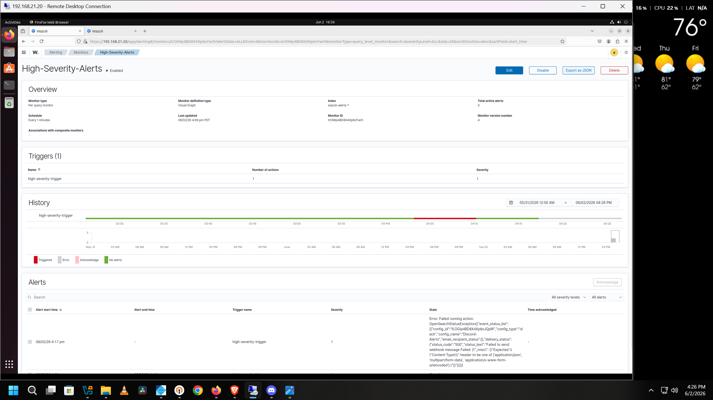

# 🛡️ Home Enterprise SOC Lab

Built a home SOC lab by integrating Wazuh SIEM with my existing pfSense firewall and Suricata IDS to monitor real network threats across multiple endpoints including an Active Directory environment. Detected live NMAP scans from Bulgaria and other countries using GeoIP visualization and forwarded alerts to Discord in real time.

---

## 🧰 Technologies & Tools

| Category | Technology |
|---|---|
| SIEM | Wazuh 4.14.5 |
| Firewall / IDS | pfSense + Suricata |
| Hypervisor | TrueNAS Scale (KVM, Type 1 bare-metal) |
| VM | Ubuntu Desktop 22.04 |
| Log Forwarding | syslog-ng (pfSense to Wazuh) |
| GeoIP | MaxMind GeoLite2 City |
| Alerting | Discord Webhooks (custom-discord integration) |
| Endpoint Agents | Windows 11, Windows Server 2022, Windows 10, Kali Linux |
| Active Directory | Windows Server 2022 Domain Controller |
| Alert Monitoring | Wazuh Alerting Monitor (per query) |
| File Integrity | Wazuh FIM (syscheck, real-time monitoring) |

---

## 🖥️ Type 1 Hypervisor & VM Deployment

Deployed an Ubuntu Desktop 22.04 VM on TrueNAS Scale running as a KVM-based Type 1 bare-metal hypervisor. Allocated 4 cores, 4 threads, and 16GB RAM from the available pool. The VM runs all Wazuh components including the manager, indexer, dashboard, and Filebeat. Accessed remotely via RDP from any device on the network or over VPN.

**VM Specs:**
- Virtual CPUs: 1 / Cores: 4 / Threads: 4
- Memory: 16 GiB
- Storage: 250 GiB
- Boot: UEFI

---

## 📊 Wazuh SIEM Dashboard

Wazuh all-in-one deployment on Ubuntu 22.04 handling log ingestion, analysis, and visualization across all monitored endpoints. The dashboard shows a live summary of alert severity across the last 24 hours broken down by endpoint security, threat intelligence, and compliance modules.

**Last 24 hours at time of screenshot:**
- Critical severity (level 15+): 0
- High severity (level 12-14): 1
- Medium severity (level 7-11): 10,849
- Low severity (level 0-6): 17,519

---

## 🔗 Agents Connected

Four active Wazuh agents connected across different operating systems and environments. The DC and Windows 10 client are part of an Active Directory lab running on VirtualBox.

| Agent ID | Name | OS | IP |
|---|---|---|---|
| 001 | Nicks-Windows-PC | Windows 11 Pro | 192.168.21.11 |
| 002 | DC-Server-2022 | Windows Server 2022 | 10.0.2.15 |
| 003 | Win10-Client-VM | Windows 10 Pro | 172.16.0.100 |
| 005 | Kali-Laptop-Nick | Kali Linux 2026.2 | 192.168.21.17 |

---

## 🚨 Suricata Alerts Integrated from pfSense

Suricata running on pfSense forwards eve.json logs to Wazuh via syslog-ng. The Threat Hunting dashboard shows live Suricata detections ingested directly from the firewall including NMAP stealth scans, suspicious inbound probes to MSSQL (port 1433), MySQL (port 3306), and Oracle SQL (port 1521).

**How it works:**
- Suricata writes alerts to eve.json on pfSense
- syslog-ng reads the file and forwards over UDP to Wazuh on port 514
- Wazuh parses the JSON and indexes the alerts
- GeoIP enrichment runs on the src_ip field via Filebeat ingest pipeline

---

## 🌍 GeoIP Threat Map

GeoIP visualization built using MaxMind GeoLite2 City database integrated into the Wazuh indexer ingest pipeline. Attack origins are plotted on a world map in real time. Confirmed active scan sources from Bulgaria, France, Kazakhstan, United Kingdom, and the United States.

The Filebeat pipeline was modified to enrich the `data.src_ip` field from Suricata alerts with geolocation data and store it in `GeoLocation.location` for map rendering.

---

## 🗂️ Active Directory Event Monitoring

Windows Server 2022 Domain Controller and Windows 10 client running as Wazuh agents. The Threat Hunting dashboard captures Windows Security Event logs including user account changes, logon/logoff events, and password resets in real time. The screenshot shows a password change event on the DC alongside other AD activity.

**Events being captured:**
- User account disabled or deleted (rule 60111)
- User account changed (rule 60110)
- Windows Logon/Logoff (rule 60137)
- Windows Logon Success (rule 60106)

---

## 📁 File Integrity Monitoring

Wazuh FIM running across all agents with real-time directory monitoring configured centrally via group policy. The Win10-Client-VM shows 18,945 file integrity events in 24 hours with syscheck tracking modifications to Microsoft Edge application data at the path `c:\users\ntuck\appdata\local\microsoft\edge\user data`.

**Monitored directories (pushed to all agents via group config):**
- Linux: `/tmp`, `/home`
- Windows: `C:\Users`, `C:\Temp`

---

## 🔔 Discord Real-Time Alerts

Custom Discord integration using the `custom-discord` Python script. Wazuh forwards alerts above level 12 directly to a private Discord server via webhook. Alerts show the rule number, description, and which agent triggered them.

---

## ⚙️ Discord Integration Config

The integration is configured directly in `/var/ossec/etc/ossec.conf` on the Wazuh manager. The custom-discord script handles formatting and posting to the Discord webhook. Level threshold is set to 12 to avoid noise from routine FIM and low-level syscheck events.

---

## 📡 Alert Monitor

Per-query alert monitor configured in the Wazuh alerting module running every 1 minute against the `wazuh-alerts-*` index. Triggers on high severity events and routes to the Discord channel via the configured notification channel.

---

## 🙋 Author

**Nick Efstathiou**
Cybersecurity | Network Engineering | Home Lab
[LinkedIn](https://www.linkedin.com/in/NickStat23)
